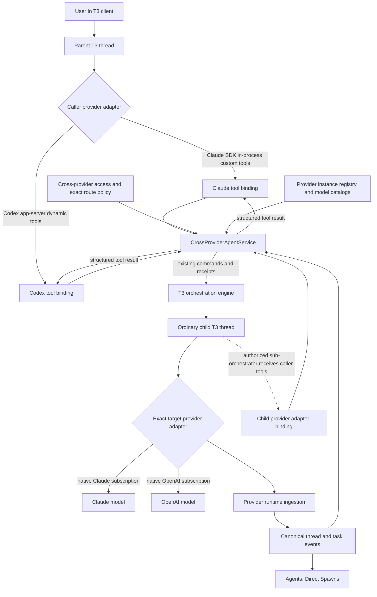

# PRD: Native cross-provider agent tools

- **Status:** Draft for implementation review
- **Date:** 2026-09-06
- **Related decision:** [Native provider tools ADR](./native-cross-provider-agent-tools-adr.md)
- **Initial callers:** Claude Agent SDK sessions and Codex app-server sessions
- **Initial targets:** configured Claude and Codex provider instances

## Summary

Add a native-feeling cross-provider agent capability to T3 Code. An authorized orchestration model
can discover eligible routes, spawn a child on an exact native provider instance, wait for it,
follow it up, or interrupt it. The child uses the user's existing Claude or OpenAI subscription,
becomes an ordinary T3 thread, and appears in **Agents → Direct Spawns**.

The primary use case is Claude Fable 5.1 as the top-level orchestrator. It can dispatch GPT-5.6 Sol
to work through the native Codex provider. When authorized, that GPT child can act as a
sub-orchestrator and dispatch further Claude or Codex children. GLM 5.3 Flash running through an
OpenRouter-backed Codex provider is also a caller, but OpenRouter must remain confined to that
parent inference path.

## Problem

T3's provider-native orchestration works inside one provider, but an external model cannot reliably
choose another configured provider instance. Model names are not sufficient because multiple
instances can advertise the same model and can have different accounts, billing, regions, and data
policies. Prompt-only aliases are brittle, while a separate CLI or HTTP MCP dispatcher duplicates
T3 lifecycle behavior.

Users need explicit, inspectable, fail-closed routing through T3's existing provider and
orchestration machinery without maintaining forks of the provider CLIs.

## Goals

- Let Fable 5.1 spawn native Codex children through the user's OpenAI subscription.
- Let an authorized GPT-5.6 Sol child fan out to native Claude and Codex children.
- Let GLM 5.3 Flash spawn native GPT-5.6 Luna and Claude Haiku children without routing those
  children through OpenRouter.
- Display all spawned children in the existing Direct Spawns UI with correct live and settled
  state.
- Use stable exact provider-instance IDs and explicit model IDs.
- Preserve project, worktree, permission, environment, parent-child, and session-resume semantics.
- Keep the implementation close to upstream T3 Code and localized at provider adapter boundaries.
- Provide a user-visible, editable cross-provider route configuration with safe generated defaults
  and a restore-defaults action.

## Non-goals

- Changing or replacing native same-provider spawn behavior.
- Forking or patching Claude Code, the Claude Agent SDK, Codex CLI, or Codex app-server.
- Invoking Claude or OpenAI children through OpenRouter.
- Supporting self-hosted models or adding a model proxy.
- Upgrading the shared Effect MCP server or changing its preview/browser tools.
- Adding a loopback HTTP MCP server for agent operations.
- Adding shell scripts, a CLI supervisor, or repository instructions as the dispatch mechanism.
- Fixing OpenRouter/Fireworks/Baseten HTTP 429 behavior or adding inference retries.
- Supporting Cursor, Grok, OpenCode, or Antigravity as cross-provider callers or targets in the
  initial release.
- Silently truncating, summarizing, or storing child output out of context.

## Users and scenarios

### Primary: Claude orchestrator

A user starts a Fable 5.1 thread on their authenticated Claude provider. Cross-provider access is
enabled. Fable asks the catalog for eligible targets, selects the configured native Codex instance,
spawns GPT-5.6 Sol, waits for its result, and continues its own turn. The child appears in Direct
Spawns throughout.

### Nested: Codex sub-orchestrator

Fable delegates a bounded workstream to GPT-5.6 Sol and authorizes it to orchestrate. The GPT child
receives the same provider-native cross-provider tools, then spawns one or more native children. T3
preserves the ownership chain and shows each direct spawn under the thread that created it.

### Custom-model caller

A user starts GLM 5.3 Flash on an OpenRouter-backed Codex provider instance. GLM uses Codex dynamic
tools to spawn GPT-5.6 Luna on the user's separate native Codex subscription or Claude Haiku on the
native Claude subscription. The requested target instance—not the parent instance's API endpoint—
determines the child's provider and billing path.

## Product behavior

### Access and configuration

Add a **Cross-provider agent access** setting to control the capability.

When enabled:

- T3 generates a default allowlist from enabled, authenticated, supported provider instances and
  their current model catalogs.
- The generated configuration is visible in a collapsed-by-default advanced accordion.
- Users may edit provider-instance/model eligibility explicitly.
- A **Restore defaults** action replaces manual edits with the current generated defaults after the
  normal confirmation treatment for a lossy settings edit.
- New and resumed authorized Claude and Codex sessions receive the tool surface.

When disabled, no cross-provider tools are injected and no new cross-provider operation is
accepted. Existing children remain ordinary T3 threads and retain normal manual controls.

The setting must behave consistently on web, desktop, and mobile where provider administration is
available. It must use normal server contracts so remote and tunnel-connected clients configure the
owning environment rather than local browser state.

### Routing

The catalog returns compact entries containing stable `providerInstanceId`, display label, driver,
and eligible model IDs. Callers submit the exact provider instance and model. T3 validates both
against current server state at execution time.

No alias guessing is allowed. `Claude`, `anthropic`, a display label, and a historical internal ID
are not interchangeable unless the stored configuration explicitly maps them to one unambiguous
current instance. Model-name matching across instances is prohibited.

### Agent operations

The initial logical operations are:

| Operation         | Behavior                                                   | Mutation          |
| ----------------- | ---------------------------------------------------------- | ----------------- |
| `agent_catalog`   | Lists only currently eligible routes                       | No                |
| `agent_spawn`     | Creates and starts one owned child thread                  | Yes, exactly once |
| `agent_wait`      | Subscribes to canonical events until owned children settle | No new child      |
| `agent_follow_up` | Starts a new turn on an owned settled child                | Yes, exactly once |
| `agent_interrupt` | Requests interruption of an owned active child             | Yes, exactly once |

Provider bindings may namespace names to avoid a collision, but descriptions, input schemas,
outputs, errors, and semantics must remain equivalent. Tool descriptions must direct the model to
use these operations only for cross-provider targets; same-provider native tools remain the normal
path.

`agent_wait` must use T3 event subscriptions and receipts, not sleep or polling. A successful wait
returns terminal state and the child output needed by the parent. The child itself talks directly
to its provider adapter on every turn; it does not use MCP merely because the parent used a Claude
in-process tool.

### Direct Spawns

`agent_spawn` creates the same canonical thread and task activities used by existing native
dispatch. The current projector and Agents UI remain the source of truth. The feature must not add
a second agent table, websocket feed, status enum, or UI-only synthetic spawn.

The UI must show the correct model, target provider identity where currently supported, live state,
run count, token usage, completion summary, and nested ownership according to existing behavior.

### Failure behavior

- Invalid, disabled, unauthenticated, ineligible, ambiguous, or stale routes fail before child
  creation.
- Unsupported caller adapters do not receive tools and fail closed if a stale call arrives.
- Provider failures are reported with structured T3 errors without substituting another provider.
- A lost response after a mutating command never causes an automatic duplicate mutation.
- Parent inference failures after a child settles do not rewrite the child as failed or working.
- A child result remains available through canonical thread state after reconnect or parent failure.

## Build shape

### Component responsibilities

#### `CrossProviderAgentService`

- Is provider-neutral and depends on existing registry/orchestration services.
- Resolves eligibility and exact route identity.
- Enforces ownership and access policy.
- Converts operations into existing commands and awaits typed receipts/events.
- Returns small structured values without provider transport details.
- Does not know MCP framing or Codex JSON-RPC message shapes.

#### Claude adapter binding

- Creates in-process SDK tool definitions only for authorized sessions.
- Maps SDK tool input/output to the shared service.
- Installs tools consistently on start and resume.
- Does not register the tools with T3's HTTP Effect MCP server.
- Preserves the user's Claude subscription process and current adapter behavior.

#### Codex adapter binding

- Supplies dynamic tool specifications on start and resume.
- Handles `item/tool/call` requests and sends `DynamicToolCallResponse` through the existing
  app-server connection.
- Correlates responses to the originating thread and call.
- Preserves existing Codex authentication, custom-model configuration, native tools, and event
  normalization.
- Does not edit generated app-server schema files by hand.

#### Configuration and client

- Stores environment-owned eligibility policy using typed contracts.
- Auto-populates supported routes when access is first enabled.
- Exposes manual editing and restore-defaults in an expandable advanced section.
- Never returns secrets or provider environment variables to clients.

## Functional requirements

1. A Claude Fable 5.1 session can catalog and spawn GPT-5.6 Sol on the exact native Codex instance.
2. A GLM 5.3 Flash Codex session can spawn GPT-5.6 Luna and Claude Haiku on their exact native
   subscription instances.
3. An authorized GPT-5.6 Sol child can use the same logical tools to fan out.
4. Every successful spawn creates one ordinary durable child thread with a stable ownership link.
5. Every child is visible through existing Direct Spawns activities while queued, working,
   completed, failed, or interrupted.
6. Wait, follow-up, and interrupt work after server reconnect using durable thread state.
7. Manual policy edits survive restart; restore-defaults recomputes from current supported
   instances and catalogs.
8. Removing eligibility prevents future operations without corrupting existing child history.
9. A route mismatch produces a useful structured error naming the rejected instance/model but not
   secrets.
10. Disabling access removes tool injection on the next start/resume and rejects server-side calls
    from stale sessions.

## Non-functional requirements

- **Security:** Use the current environment's authenticated provider instances. Never transmit API
  keys, auth files, provider homes, or tokens through tool schemas/results.
- **Correctness:** Mutations are exactly once at the command boundary. Reads and waits may safely
  resume from durable state.
- **Performance:** Do not poll. Catalog results are compact. Do not add a continuously updating
  client feed beyond existing orchestration events.
- **Remote readiness:** All state and decisions live on the T3 server owning the environment.
- **Compatibility:** Preserve web, desktop, mobile, local, relay, and tunnel contracts.
- **Maintainability:** Provider-specific code stays in adapters; shared orchestration code does not
  import Claude SDK or Codex protocol types.
- **Observability:** Log stable thread/call/provider instance identifiers and state transitions,
  never prompts, outputs, keys, or auth data by default.

## Known traps from abandoned branches

### First branch: hand-rolled dispatcher

- Shell/CLI dispatch bypassed ordinary T3 session ownership and encouraged a supervisor process.
- Provider authentication and billing could diverge from the instance selected in T3.
- Children required special work to appear and settle correctly in Direct Spawns.
- Resumption, follow-up, interruption, permissions, and project/worktree propagation became a
  second lifecycle to maintain.
- Repository instructions or skills were needed to teach models implementation-specific routing.

Do not reuse this transport or its scripts. A useful behavior must be re-expressed through the
shared service and existing T3 orchestration commands.

### Second branch: HTTP MCP dispatcher

- The agent toolkit was added to the Effect HTTP MCP server originally used for preview/browser
  collaboration, coupling unrelated lifecycles.
- MCP 2025-06-18 discovery/session/auth plumbing added overhead without improving child execution.
- Tool schemas and large catalog/child results could remain in the parent context.
- Friendly provider names and historical IDs caused ambiguous or incorrect calls.
- Endpoint and bearer-token scope created failures unrelated to agent execution.
- `agent_wait` could return a completed child while the parent still needed another inference to
  synthesize the answer; a parent 429 then made a successful child look like an orchestration
  failure.
- Duplicate or stale activity handling could leave Direct Spawns reporting working after the child
  had settled.
- The global tool surface made nested fan-out possible but also made authorization and ownership
  boundaries easy to blur.

The observed intermittent 429 responses across OpenRouter upstream providers are not proof that
the MCP layer caused them. They occurred on GLM parent inference and exposed the absence of a safe
parent-continuation recovery strategy. This product does not add such retries. It must, however,
preserve the settled child independently of the parent failure.

### Cross-cutting traps

- A model name is not a provider route.
- OpenRouter guardrails do not replace T3's exact target validation.
- A successful upstream child response does not imply the parent continuation succeeded.
- Retrying an entire turn can duplicate a spawn or follow-up.
- Model-visible tools always have context cost, even when transport overhead is removed.
- Native Claude custom tools are still MCP-shaped inside the SDK; describing them as wholly
  non-MCP would be inaccurate.
- Generated protocol types prove a Codex feature exists, but not that the current adapter handles
  its server requests correctly.
- Session start support alone is insufficient; resume, reconnect, interrupt, and access revocation
  must be covered.

## Builder escalation rules

The builder must stop, document evidence, and ask the orchestrator before changing the design when
any condition below is encountered. It must not construct a workaround.

1. **Provider contract gap:** The pinned Claude SDK cannot install in-process tools per session, or
   Codex app-server cannot register and answer dynamic tools through a supported public contract.
2. **Binary changes:** Progress appears to require patching or forking Claude Code, Codex CLI, or
   Codex app-server.
3. **Transport substitution:** Progress appears to require an HTTP MCP server, loopback proxy,
   shell command, CLI supervisor, or external dispatcher.
4. **Generated contract edits:** The implementation would require hand-editing generated Codex
   protocol schemas rather than consuming them.
5. **Routing ambiguity:** An exact provider instance/model cannot be established, or a fallback to
   another instance/provider seems necessary.
6. **Authentication ambiguity:** It is unclear which subscription/account will be charged, or a
   credential must cross the tool boundary.
7. **Lifecycle duplication:** A new child/status store, projector, websocket stream, polling loop,
   or parallel Direct Spawns implementation seems necessary.
8. **Mutation replay:** A retry or reconnect path could repeat spawn, follow-up, or interrupt, and
   existing command idempotency cannot prove exact-once behavior.
9. **Retry expansion:** A proposed fix adds HTTP 429 retries, promptless parent continuation,
   provider fallback, or any inference retry. This is expressly outside scope.
10. **Same-provider regression:** Existing Claude→Claude or Codex→Codex native spawn behavior must
    be intercepted, renamed, disabled, or reimplemented.
11. **Session inconsistency:** Tools cannot be installed and revoked consistently across new,
    resumed, reconnected, and nested authorized sessions.
12. **Tool collision:** Provider-native tools collide with the proposed names or give the model two
    indistinguishable ways to perform a cross-provider mutation.
13. **Result semantics:** Correctness appears to require silently truncating, summarizing, caching,
    or externalizing child output.
14. **Ownership uncertainty:** The caller cannot be proven to own or be authorized over the target
    child, including nested fan-out or follow-up after restart.
15. **Context propagation:** Project, worktree, permission mode, environment, or provider instance
    cannot be propagated through existing thread-creation contracts.
16. **Surface expansion:** Correctness would require supporting another provider adapter, changing
    provider auth storage, or adding unrelated settings/UI.
17. **Protocol migration:** The feature appears to require upgrading or changing T3's existing
    Effect MCP protocol or preview/browser server.
18. **Unspecified policy:** A new limit or policy is needed—for example maximum orchestration depth,
    cycle handling, output-size limits, or per-model permissions—and the requirement is not already
    explicit here.

An escalation report must include the failing contract or invariant, the smallest reproducible
case, relevant source locations, and two bounded options with trade-offs. The builder must not
implement either option until the orchestrator approves it.

## Delivery sequence

1. **Contract spike (no product behavior):** Prove, with focused adapter tests, that the pinned
   Claude SDK can invoke an in-process tool and that Codex app-server can invoke and receive a
   dynamic-tool response. Escalate immediately if either proof fails.
2. **Shared service:** Implement catalog, exact route validation, ownership, spawn, wait, follow-up,
   and interrupt using existing commands, events, and receipts.
3. **Codex binding:** Add dynamic-tool injection and request handling, including start, resume,
   reconnect, interruption, and access revocation tests.
4. **Claude binding:** Add in-process SDK tool injection with the same logical schemas and lifecycle
   coverage.
5. **Configuration:** Add typed environment settings, generated defaults, advanced manual editor,
   and restore-defaults behavior across applicable clients.
6. **Integrated validation:** Exercise only the approved initial matrices and verify Direct Spawns,
   subscription routing, nested ownership, reconnect, and failure behavior.

Each step should be reviewable independently. Do not begin the next step by working around an
unresolved contract failure in the previous one.

## Acceptance criteria

- Fable 5.1 → native GPT-5.6 Sol completes, and the child appears and settles once in Direct Spawns.
- GLM 5.3 Flash → native GPT-5.6 Luna completes without an OpenRouter GPT generation.
- GLM 5.3 Flash → native Claude Haiku completes without an OpenRouter Claude generation.
- Fable 5.1 → GPT-5.6 Sol → Claude Haiku nested fan-out completes with correct ownership and native
  subscription routes.
- An invalid provider alias, wrong model, disabled instance, and stale catalog entry each fail
  before creating a child.
- A simulated lost tool response cannot produce duplicate child threads or turns.
- A parent failure after child completion leaves the child settled and retrievable.
- Turning access off removes tools on new/resumed sessions and rejects stale server-side calls.
- Existing native same-provider dispatch tests pass unchanged.
- No agent tools are added to the Effect HTTP MCP server, and no changes are made to provider
  binaries, auth files, or generated Codex schemas.
- Focused tests assert orchestration events and receipts, not only returned JSON.
- Logs and persisted settings contain no secrets.

## Test matrix

| Caller                       | Target             | Required result                                          |
| ---------------------------- | ------------------ | -------------------------------------------------------- |
| Claude Fable 5.1             | Codex GPT-5.6 Sol  | Native subscription child; one Direct Spawn              |
| Codex-hosted GLM 5.3 Flash   | Codex GPT-5.6 Luna | Target native Codex instance; no OpenRouter GPT call     |
| Codex-hosted GLM 5.3 Flash   | Claude Haiku       | Target native Claude instance; no OpenRouter Claude call |
| GPT-5.6 Sol sub-orchestrator | Claude Haiku       | Authorized nested child with correct ownership           |

For deterministic automated tests, use fake provider adapters and event receipts. Real-model
validation is a separate manual pass limited to GLM 5.3 Flash, GPT-5.6 Luna, GPT-5.6 Sol, Fable 5.1,
and Claude Haiku as required by the scenario. Never expose keys in fixtures, logs, screenshots, or
commits.

## Success measures

- No cross-provider child is billed through an unintended provider in the approved test matrix.
- One requested spawn produces exactly one durable child and one canonical Direct Spawns entry.
- No agent dispatch requires repository prompt files, scripts, or a supervisor.
- The feature remains a small adapter/service/settings delta during the next upstream rebase.
- Failures identify route, authorization, provider, or parent-continuation boundaries accurately
  rather than presenting a settled child as failed.

## Open decisions requiring approval before implementation

- Final public tool names and whether provider namespaces are required to avoid native collisions.
- Whether every eligible child may orchestrate or whether orchestration authority is an explicit
  per-spawn flag. The intended product supports GPT sub-orchestrators, but the authorization shape
  must be chosen before coding.
- Maximum returned child-output size and behavior above that size; no truncation is currently
  authorized.
- Whether route-policy edits apply immediately to running sessions or only on next resume.
- Whether an explicit orchestration-depth or cycle policy is required for the initial release.

These are design decisions, not invitations for builder discretion. The implementation session
must resolve them with the orchestrator before committing code that depends on an answer.
