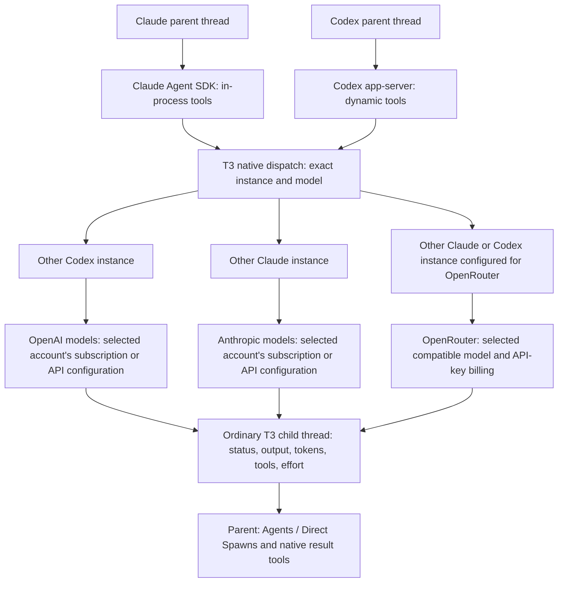

# Cross-provider agents

A Claude or Codex thread can hand work to a child thread on one of your _other_ configured
providers: a Claude orchestrator can delegate to your Codex subscription, and a Codex thread can
delegate to Claude. Each child is an ordinary thread in the same project, worktree, and branch, and
appears under **Agents → Direct Spawns** on the parent while it runs, with the same live status,
token, tool, and effort details as a native subagent. Delegating inside one provider keeps using
that provider's own subagent tools; this feature only covers crossing providers.

Children do not appear in the thread list, search, or the mobile home screen. Open one by clicking
its row under **Agents → Direct Spawns** on the parent; it is a normal thread from there, and its
link keeps working after a reconnect.

A child runs at the reasoning effort the parent asked for. When the parent does not ask, the child
uses the parent thread's own effort if the other provider's model offers that level, otherwise that
model's default.

## Turning it on

Open **Settings → Integrations → Agents** and enable **Cross-provider agent access**. New and resumed
Claude sessions and new Codex sessions started after that get the tools; running sessions pick them
up on their next start.

Children use the provider instance you configured, with that instance's own sign-in and billing, so
a delegated task may consume the other provider's paid quota.

## Choosing who can be a target

By default every enabled Claude and Codex instance is a target with all of its models, including
API-key-backed instances; only an instance that is explicitly signed out is left out.
Expand **Routes** to switch instances off or limit the models an agent may pick. **Restore
defaults** discards your edits and goes back to tracking your provider list.

**Max orchestration depth** decides how far delegation can nest: `1` lets the parent spawn children
that cannot delegate further; `2` (the default) lets a child that was explicitly granted the tools
fan out one more level.

**Child output cap** limits how much of a child's final answer is returned to the parent in one
piece. Longer answers come back as a head and a tail, clearly marked, and the parent can request
the rest.

## Cross-lab and cross-subscription dispatch

The destination is a specific provider instance and an exact model from its catalog. For example,
a Claude parent can delegate to a Codex instance signed into an OpenAI subscription, and a Codex
parent can delegate to a Claude instance signed into an Anthropic subscription. Separate accounts
use separate configured instances. The destination's credentials and billing apply to its work.

The diagram shows alternative destinations. Each spawn selects one exact instance and model;
T3 does not substitute another provider or silently fall back to OpenRouter. The current caller
instance is excluded as a cross-provider target. Work inside that same instance continues to use
its own native subagent tools.

Claude and Codex are the supported dispatch harnesses. Other labs' models can participate through
an OpenRouter configuration supported by one of those harnesses, provided the instance exposes
the model in its catalog and the route allows it. Other T3 provider drivers do not gain these
cross-provider tools from this change.

## OpenRouter

Use the existing provider-instance configuration in **Settings → Providers**. The
[Claude OpenRouter setup](./providers-claude.md#openrouter) describes the direct endpoint and
credential settings. A Codex instance already configured for a compatible OpenRouter model can
also participate through its existing Codex configuration. Keep router-backed instances separate
from subscription instances so the intended account, endpoint, and billing are explicit.

Enable the instance and confirm its model appears in the provider catalog, then allow that
instance and model under **Settings → Integrations → Agents → Routes**. API-key instances remain
eligible when their authentication status is unknown; an explicitly signed-out instance is
excluded. Ask the parent to use that exact instance and model and check the child row and
OpenRouter activity to confirm the destination.

No CLI proxy or separate routing daemon is required. T3 dispatches through the configured
provider's existing harness; compatibility with the selected model and endpoint still depends on
that harness.

## Remote environments

This fork retains T3 Code's existing [remote access](./remote-access.md) and machine load
balancing. Machine selection places a new parent thread on an environment; cross-provider
dispatch then selects another provider instance on that environment. Child threads share the
parent's project, worktree, and branch. Cross-provider dispatch does not itself move a child to
another machine.

## Things to know

- A Codex thread only receives the tools when its session starts. If T3 has to resume that Codex
  session later (for example after the server restarts), the thread shows a notice and the tools
  are unavailable until you start a new thread. Claude sessions get the tools again on resume.
- Interrupting a child, following it up, or reading its result works from the parent thread as well
  as from the child's own view.
